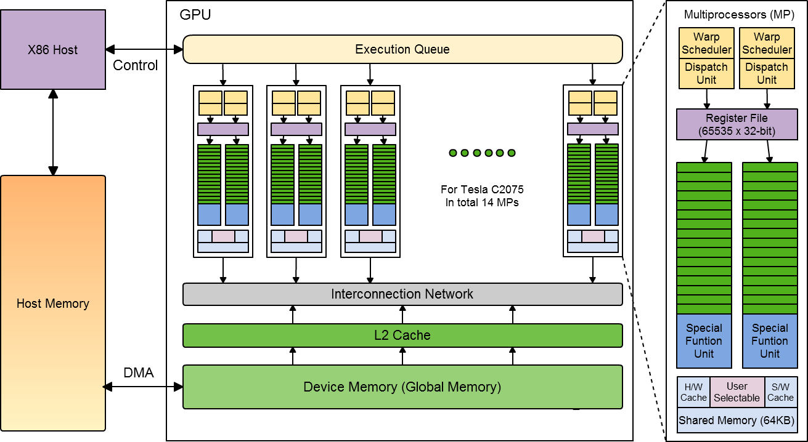

Introduction to GPU architecture
================================

.. questions::

   - What is different about GPUs?
   - TODO

.. objectives::

   - Understand TODO
   - Understand TODO
   - Understand 
   - Understand 

.. prereq::

   1. TODO
   2. TODO

Introduction
------------
Why use GPUs?
~~~~~~~~~~~~~
.. figure:: img/comparison.png
   :align: center
   
The Graphics Processing Unit (GPU) provides much higher instruction throughput and memory bandwidth than the CPU within a similar price and power envelope.
What is different?
~~~~~~~~~~~~~~~~~~
.. figure:: img/gpu_vs_cpu.png
   :align: center
   

The GPU is specialized for highly parallel computations and therefore designed such that more transistors are devoted to data processing rather than data caching and flow control.

Different Philosophies
~~~~~~~~~~~~~~~~~~~~~~
CPUs and GPUs  are designed with different goals in mind. While the CPU is designed to excel at executing a sequence of operations, called a thread, as fast as possible and can execute a few tens of these threads in parallel, the GPU is designed to excel at executing thousands of them in parallel. The GPU is specialized for highly parallel computations and therefore designed such that more transistors are devoted to data processing rather than data caching and flow control. More transistors dedicated to data processing is beneficial for highly parallel computations; the GPU can hide memory access latencies with computation, instead of relying on large data caches and complex flow control to avoid long
memory access latencies, both of which are expensive in terms of transistors.

.. list-table::  
   :widths: 100 100
   :header-rows: 1

   * - CPU
     - GPU
   * - General purpose
     - Highly specialized for parallelism
   * - Good for serial processing
     - Good for parallel processing
   * - Great for task parallelism
     - Great for data parallelism
   * - Low latency per thread
     - High-throughput
   * - Large area dedicated cache and control
     - Hundreds of floating-point execution units

GPU Programming Model
---------------------

Heterogeneous CPU-GPU System
~~~~~~~~~~~~~~~~~~~~~~~~~~~~

The GPUs (devices) can not operate by themselves. They are always part of a system (host) in which the CPUs run the operating systems and control the programs execution. This is reflected in the programming model. 

Heterogeneous Programming
~~~~~~~~~~~~~~~~~~~~~~~~~
.. figure:: img/heteprogra.jpeg
   :align: center

CPU (host) and GPU (device) codes are mixed. The host makes all calls, allocates the memory,  and  handles the memory transfers between CPU and GPU. The device code is executed by doing calls to functions written specifically to take advantage of the GPU (kernels). The kernel calls are asynchronous, the control is returned to the host after a kernel calls. All kernels are executed sequentially. 

Thread Hierarchy
~~~~~~~~~~~~~~~~
.. figure:: img/ThreadExecution.jpeg
   :align: center

Parallelism is exposed via ....

Automatic Scalability
~~~~~~~~~~~~~~~~~~~~~
.. figure:: img/Automatic-Scalability-of-Cuda-via-scaling-the-number-of-Streaming-Multiprocessors-and.png
   :align: center

Thread Scheduling. SIMT
~~~~~~~~~~~~~~~~~~~~~~~
.. figure:: img/Loom.jpeg
   :align: center

- Warps (waves) of 32 (64) parallel threads
- Consecutive, increasing thread IDs
- All executing one common instruction at a time
- Conditional branches are executed serially
- Memory accesses are per warp (wave)

CUDA C/HIP code example
~~~~~~~~~~~~~~~~~~~~~~~

.. typealong:: Vector addition on GPU

   .. tabs::

      .. tab:: Cuda C
         
         .. code-block:: C++
             
            ...

            int *a_d,*b_d,*c_d;
            cudaMalloc((void **)&a_d,Nbytes);
            cudaMalloc((void **)&b_d,Nbytes);
            cudaMalloc((void **)&c_d,Nbytes);

            cudaMemcpy(a_d,a,nBytes,cudaMemcpyHostToDevice);
            cudaMemcpy(b_d,b,nBytes,cudaMemcpyHostToDevice);

            vecAdd<<<gridSize,blockSize>>>(a_d,b_d,c_d,N);

            cudaDeviceSynchronize();
                                
      .. tab:: HIP
         
         .. code-block:: C++
            
            ...

            int *a_d,*b_d,*c_d;
            hipMalloc((void **)&a_d,Nbytes);
            hipMalloc((void **)&b_d,Nbytes);
            hipMalloc((void **)&c_d,Nbytes);

            hipMemcpy(a_d,a,Nbytes,hipMemcpyHostToDevice));
            hipMemcpy(b_d,b,Nbytes,hipMemcpyHostToDevice));

            hipLaunchKernelGGL(vecAdd, dim3(gridSize), dim3(blockSize), 0, 0, a_d,b_d,c_d,N);
          
            hipDeviceSynchronize();

.. code-block:: C++
   
   __global__ void vecAdd(int *a_d,int *b_d,int *c_d,int N)
   {
       int i = blockIdx.x * blockDim.x + threadIdx.x;
       if(i<N)
       {
         c_d[i] = a_d[i] + b_d[i];
       }
   }

Second heading
--------------
Some more text, with a figure

.. figure:: img/stencil.svg
   :align: center

   This is a sample image

.. exercise::

   TODO get the students to think about the content and answer a Zoom quiz

.. solution::

   Hide the answer and reasoning in here

Some source code
----------------

Sometimes we need to look at code, which can be in the webpage and optionally
you can pull out only some lines, or highlight others. Make sure both C++ and Fortran examples exist and work.

.. typealong:: The field data structure

   .. tabs::

      .. tab:: C++

         .. literalinclude:: code-samples/serial/heat.h
                        :language: cpp
                        :lines: 7-17
                                
      .. tab:: Fortran

         .. literalinclude:: code-samples/serial/fortran/heat_mod.F90
                        :language: fortran
                        :lines: 9-15

Building the code
-----------------

If there's terminal output to discuss, show something like::

  nvc++ -g -O3 -fopenmp -Wall -I../common -c main.cpp -o main.o
  nvc++ -g -O3 -fopenmp -Wall -I../common -c core.cpp -o core.o
  nvc++ -g -O3 -fopenmp -Wall -I../common -c setup.cpp -o setup.o
  nvc++ -g -O3 -fopenmp -Wall -I../common -c utilities.cpp -o utilities.o
  nvc++ -g -O3 -fopenmp -Wall -I../common -c io.cpp -o io.o
  nvc++ -g -O3 -fopenmp -Wall -I../common main.o core.o setup.o utilities.o io.o ../common/pngwriter.o -o heat_serial  -lpng

Running the code
----------------

To show a sample command line, use this approach

.. code-block:: bash

   ./heat_serial 800 800 1000

.. keypoints::

   - TODO summarize the learning outcome
   - TODO
