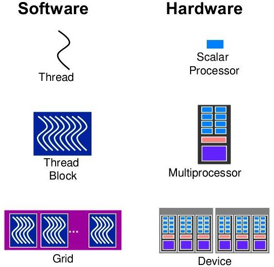
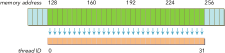

Introduction to GPU architecture
================================

.. questions::

   - Why use GPUs?
   - What is different about GPUs?
   - What is the programming model?

.. objectives::

   - Understand GPU architecture (resources available to programmer) 
   - Understand execution model 

.. prereq::

   1. Basic C or FORTRAN
   2. Basic knowledge about processes and threads

Moore's law
-----------

The number of transistors in a dense integrated circuit doubles about every two years.
More transistors means smaller size of a single element, so higher core frequency can be achieved.
However, power consumption scales as frequency in third power, so the growth in the core frequency has slowed down significantly.
Higher performance of a single node has to rely on its more complicated structure and still can be achieved with SIMD, branch prediction, etc.

.. figure:: img/microprocessor-trend-data.png
   :align: center

   The evolution of microprocessors.
   The number of transistors per chip increase every 2 years or so.
   However it can no longer be explored by the core frequency due to power consumption limits.
   Before 2000, the increase in the single core clock frequency was the major source of the increase in the performance.
   Mid 2000 mark a transition towards multi-core processors.

Achieving performance has been based on two main strategies over the years:

    - Increase the single processor performance: 

    - More recently, increase the number of physical cores.

Why use GPUs?
~~~~~~~~~~~~~

The Graphics processing units (GPU) have been the most common accelerators during the last few years, the term GPU sometimes is used interchangeably with the term accelerator. 

.. figure:: img/comparison.png
   :align: center
   
   A growth in accelerator performance over the years in comparison to Intel CPU performance. 
   The Graphics Processing Unit (GPU) provides much higher instruction throughput and memory bandwidth than the CPU within a similar price and power envelope.

What is different?
~~~~~~~~~~~~~~~~~~

CPUs and GPUs were designed with different goals in mind. While the CPU is designed to excel at executing a sequence of operations, called a thread, as fast as possible and can execute a few tens of these threads in parallel, the GPU is designed to excel at executing many thousands of them in parallel. GPUs were initially developed for highly-parallel task of graphic processing and therefore designed such that more transistors are devoted to data processing rather than data caching and flow control. More transistors dedicated to data processing is beneficial for highly parallel computations; the GPU can hide memory access latencies with computation, instead of relying on large data caches and complex flow control to avoid long
memory access latencies, both of which are expensive in terms of transistors.

.. figure:: img/gpu_vs_cpu.png
   :align: center

    A comparison of the CPU and GPU architecture.
    CPU (left) has complex core structure and pack several cores on a single chip.
    GPU cores are very simple in comparison, they also share data and control between each other.
    This allows to pack more cores on a single chip, thus achieving very hich compute density.

.. list-table::  
   :widths: 100 100
   :header-rows: 1

   * - CPU
     - GPU
   * - General purpose
     - Highly specialized for parallelism
   * - Good for serial processing
     - Good for parallel processing
   * - Great for task parallelism
     - Great for data parallelism
   * - Low latency per thread
     - High-throughput
   * - Large area dedicated cache and control
     - Hundreds of floating-point execution units

GPU Programming Model
---------------------

Accelerator model
~~~~~~~~~~~~~~~~~~~~~~~~~~~~
.. figure:: img/HardwareReview.png
   :align: center

Accelerators are a separate main circuit board with the processor, memory, power management, etc., but they can not operate by themselves. They are always part of a system (host) in which the CPUs run the operating systems and control the programs execution. This is reflected in the programming model. 

GPU Autopsy. Volta GPU
~~~~~~~~~~~~~~~~~~~~~~

.. figure:: img/volta-architecture.png
    :align: center

    A scheme of NVIDIA Volta GPU.

NVIDIA Volta streaming multiprocessor (SM):

- 64 single precision cores

- 32 double precision cores

- 64 integer cores

- 8 Tensore cores

- 128 KB memory block for L1 and shared memory

  - 0 - 96 KB can be set to user managed shared memory

  - The rest is L1

- 65536 registers - enables the GPU to run a very large number of threads

.. figure:: img/volta-sm-architecture.png
    :align: center

    A scheme of NVIDIA Volta streaming multiprocessor.
    
Heterogeneous Programming
~~~~~~~~~~~~~~~~~~~~~~~~~
.. figure:: img/heteprogra.jpeg
   :align: center

CPU (host) and GPU (device) codes are mixed. CPU acts as a main processor, controlling the execution workflow.  The host makes all calls, allocates the memory,  and  handles the memory transfers between CPU and GPU. GPUs run tens of thousands of threads simultaneously on thousands of cores and does not do much of the data management. The device code is executed by doing calls to functions (kernels) written specifically to take advantage of the GPU. The kernel calls are asynchronous, the control is returned to the host after a kernel calls. All kernels are executed sequentially. 

Thread Hierarchy
~~~~~~~~~~~~~~~~

In order to take advantage of the accelerators it is needed to use parallelism. All loops in which the individual iterations are independent of each other can be parallelized. When a kernel is called tens of thousands of threads are created. All threads execute the given kernel with each thread executing the same instructions on different data (*S*ingle *I*instruction *M*ultiple *D*ata parallel programming model). These threads are grouped in blocks which are assgined to the SMs. The blocks can not be splitted among the SMs, but in a SM several blocks can be active at a moment. Threads in a block can interact with each other, they can exchange data via the so called shared memory and they can be synchronized. The blocks can not interact with other blocks.

With many cores trying to access the memory simultaneously and with little cache available, the accelerator can run out of memory very quickly. This makes the data management and its access pattern is essential on the GPU. Accelerators like to be overloaded with the number of threads, because they can switch between threads very quickly. This allows to hide the memory operations: while some threads wait, others can compute. 

Automatic Scalability
~~~~~~~~~~~~~~~~~~~~~

.. figure:: img/Automatic-Scalability-of-Cuda-via-scaling-the-number-of-Streaming-Multiprocessors-and.png
   :align: center

This programming model automatically implies automatic scalability. Because the blocks are independent of each other they can be executed on any order. A GPU with more SM will be able to run more blocks in the same time.

Thread Scheduling. SIMT
~~~~~~~~~~~~~~~~~~~~~~~

A very important concept in GPU programming model is the warp (in CUDA) or wave (in HIP). 

.. figure:: img/Loom.jpeg
   :align: center

A warp (wave) is a group of GPU threads which are grouped physically. In CUDA the warp contains 32 threads, while in HIP a wave contains 64 threads. All threads in a warp (wave) can only execute the same instructions (*S*ingle *I*struction *M*ultiple *T*hreads parallel programming model). This means that If an "if" statement is present in the code the and different threads of a warp (wave) have to do different work the warp will practically execute each branch in a serial manner. However different warps can execute different instructions.  Another important detail is that the memory accesses are done per warp (wave). In order to achieve performance the threads in a warp (wave) have to access memory locations adjacent to each other. 

CUDA C/HIP code example
~~~~~~~~~~~~~~~~~~~~~~~

.. typealong:: Vector addition on GPU

   .. tabs::

      .. tab:: Cuda C
         
         .. code-block:: C++
             
            ...

            int *a_d,*b_d,*c_d;
            cudaMalloc((void **)&a_d,Nbytes);
            cudaMalloc((void **)&b_d,Nbytes);
            cudaMalloc((void **)&c_d,Nbytes);

            cudaMemcpy(a_d,a,nBytes,cudaMemcpyHostToDevice);
            cudaMemcpy(b_d,b,nBytes,cudaMemcpyHostToDevice);

            vecAdd<<<gridSize,blockSize>>>(a_d,b_d,c_d,N);

            cudaDeviceSynchronize();
                                
      .. tab:: HIP
         
         .. code-block:: C++
            
            ...

            int *a_d,*b_d,*c_d;
            hipMalloc((void **)&a_d,Nbytes);
            hipMalloc((void **)&b_d,Nbytes);
            hipMalloc((void **)&c_d,Nbytes);

            hipMemcpy(a_d,a,Nbytes,hipMemcpyHostToDevice));
            hipMemcpy(b_d,b,Nbytes,hipMemcpyHostToDevice));

            hipLaunchKernelGGL(vecAdd, dim3(gridSize), dim3(blockSize), 0, 0, a_d,b_d,c_d,N);
          
            hipDeviceSynchronize();

.. code-block:: C++
   
   __global__ void vecAdd(int *a_d,int *b_d,int *c_d,int N)
   {
       int i = blockIdx.x * blockDim.x + threadIdx.x;
       if(i<N)
       {
         c_d[i] = a_d[i] + b_d[i];
       }
   }

Memory types
~~~~~~~~~~~~

.. figure:: img/memsch.png
   :align: center

Understanding the basic memory architecture is criticall in order to write efficient programs. GPUs have several types of memory with different access rules. All variables reside in the **Global Memory**.  This is accessible by all active threads. Each thread is allocated a set of *Registers*, and it cannot access registers that are not parts of that set.  A kernel generally stores frequently used variables that are private to each thread in registers. The cost of accessing variables from registers is less than that required to access variables from the global memory. There is a maximum of registers available for each thread, if the limit is exceed the values will be spilled. The *Shared Memory* is another fast type of memory. All threads of a block can access its shared memory and it can  can be used for inter-thread communication or as user controled cached. In addition to these,  memories with special access pattern (*Costant*, *Texture*, *Surface*) are also provided. 

Advance topics
--------------

Global Memory Access
~~~~~~~~~~~~~~~~~~~~

Grouping of threads into warps is not only relevant to computation, but also to the global memory accesses. Memory transactions are done per warp in continuous blocks of of 32B, 64B, or 128B.  In addition these memory transactions must be naturally aligned. Only the 32-, 64-, or 128-byte segments of device memory that are aligned to their size (i.e., whose first address is a multiple of their size) can be read or written by memory transactions. Not fulfilling these requirements will result in extra memory transactions. 

Shared Memory Access
~~~~~~~~~~~~~~~~~~~~
.. figure:: img/shared_mem.png
   :align: center

The shared memory is an on-chip memory with much higher bandwidth and much lower latency than the global memory. Because of this it can be used as a user programable cache. Data which needs to be used more than once in a block (by different threads for example), can be placed (cached) into the lcoal memory to avoid extra transactions with global memory. The shared memory is divided into equally-sized memory modules, called banks, which can be accessed simultaneously, but with only one access per cycle. If two addresses of a memory request fall in the same memory bank, there is a bank conflict and the access has to be serialized. In this case the memory access is splitted in multiple transactions which are conflict-free. The number of banks can differ for different GPUs. If the same data is required by different threads broadcast access will occur.

Example of a code using shared memory to perform transpose of a two dimensional array. 

.. code-block:: C++

   __global__ void transpose_kernel_naive(float *in, float *out, int width, int height) 
   {
   int x_index = blockIdx.x * tile_dim + threadIdx.x;
   int y_index = blockIdx.y * tile_dim + threadIdx.y;

   int in_index = y_index * width + x_index;
   int out_index = x_index * height + y_index;

   out[out_index] = in[in_index]; //the writing is uncoalesced. very inefficient
   }
   
   const static int tile_dim=32; // for maximum perfomarnce this should be equal to warp (wave) size ?
   __global__ void transpose_lds_kernel(float *in, float *out, int width,
                                     int height) {
   __shared__ float tile[tile_dim][tile_dim];

   int x_tile_index = blockIdx.x * tile_dim;
   int y_tile_index = blockIdx.y * tile_dim;

   int in_index = (y_tile_index + threadIdx.y) * width  + (x_tile_index + threadIdx.x);
   int out_index =(x_tile_index + threadIdx.y) * height + (y_tile_index + threadIdx.x);

   tile[threadIdx.y][threadIdx.x] = in[in_index];

   __syncthreads();

   out[out_index] = tile[threadIdx.x][threadIdx.y];
   }

Using shared memory the programmer ensures that both read and writes to the global arrays are coalesced. 

In other situations like the n-body problem type of interaction the shared memory can be used to avoid multiple loads of the same data from the memory:

.. code-block:: C++

   __global__ void
   calculate_forces(void *devX, void *devA)
   {
      extern __shared__ float4[] shPosition;
      float4 *globalX = (float4 *)devX; float4 *globalA = (float4 *)devA;
      float4 myPosition;
      int i, tile;
      float3 acc = {0.0f, 0.0f, 0.0f};
      int gtid = blockIdx.x * blockDim.x + threadIdx.x;
      myPosition = globalX[gtid];
      for (i = 0, tile = 0; i < N; i += p, tile++) {
             int idx = tile * blockDim.x + threadIdx.x;
             shPosition[threadIdx.x] = globalX[idx];
             __syncthreads();
            for (i = 0; i < blockDim.x; i++) {
               accel = bodyBodyInteraction(myPosition, shPosition[i], accel);
            }
            __syncthreads();
      }
     // Save the result in global memory for the integration step.
     float4 acc4 = {acc.x, acc.y, acc.z, 0.0f};
     globalA[gtid] = acc4;
   }

Unified Memory Access
~~~~~~~~~~~~~~~~~~~~~~
   
The Unified Memory defines a maanged memory spaced in which the CPUs and GPUs see a single coeherent image with a common address space. Because the underlying system manages the data accesses and locality within a GPU program without need for explcit memory copy calls the data movement appears more transparent to the application. Each allocation is accessible on both the CPU and GPU with the same pointer in the managed memory space and it is automatically migrated to where it is needed. Not all GPUs have support for this feature. Below there are CUDA examples codes for without and with unified memory access.

.. typealong:: Vector addition on GPU

   .. tabs::

      .. tab:: No UM
         
         .. code-block:: C++
             
            ...

            __global__ void AplusB(int *ret, int a, int b) {
               ret[threadIdx.x] = a + b + threadIdx.x;
            }
            int main() {
            int *ret;
            cudaMalloc(&ret, 1000 * sizeof(int));
            AplusB<<< 1, 1000 >>>(ret, 10, 100);
            int *host_ret = (int *)malloc(1000 * sizeof(int));
            cudaMemcpy(host_ret, ret, 1000 * sizeof(int), cudaMemcpyDefault);
            for(int i = 0; i < 1000; i++)
                   printf("%d: A+B = %d\n", i, host_ret[i]);
            free(host_ret);
            cudaFree(ret);
            return 0;
            }
                                
      .. tab:: with UM
         
         .. code-block:: C++
            
            ...

            __global__ void AplusB(int *ret, int a, int b) {
               ret[threadIdx.x] = a + b + threadIdx.x;
            }
            int main() {
            int *ret;
            cudaMallocManaged(&ret, 1000 * sizeof(int));
            AplusB<<< 1, 1000 >>>(ret, 10, 100);
            cudaDeviceSynchronize();
            for(int i = 0; i < 1000; i++)
            printf("%d: A+B = %d\n", i, ret[i]);
            cudaFree(ret);
            return 0;
           }

Without Unified Memory there are two sets of points (one for host and one for device memory space) and if the data is initialized on the host it requires a copy operation. Also in the case of the no UM the kernel calling the kernel with the host pointers would results in the code failing. 

Streams
-------

A *stream* in CUDA is a sequence of asynchronous  operations that execute on the device in the order in which they are issued by the host code. While operations within a stream are guaranteed to execute in the prescribed order, operations in different streams can be interleaved and, when possible, they can even run concurrently. When no stream is specified, the default stream (also called the “null stream”) is used. The default stream is different from other streams because it is a synchronizing stream with respect to operations on the device: no operation in the default stream will begin until all previously issued operations in any stream on the device have completed, and an operation in the default stream must complete before any other operation (in any stream on the device) will begin. The non-default streams can be used operations. The most commong use of non-default streams is for overlapping computations and data movements. 

Overlapping Computations and Data Movements
~~~~~~~~~~~~~~~~~~~~~~~~~~~~~~~~~~~~~~~~~~~
The simplest CUDA program consists of three steps: copying the memory from host to device, kernel execution, and copy the memory from device to host. As an example let's consider that the time spent to copy the data is linear with the size of the data, and that the computations can be splitted in *N* parts, each independednt of each other and that teh total amount of floping operations per part decreases by *1/N*. If the GPU overlapping data transfers and kernel execution we can image two scenarios like in the figure below.

.. figure:: img/C2050Timeline.png
   :align: center
   
In the first one all data is copied in one transfer to GPU. Next it is processed doing, then in the last step the results are copied to the host, again in one transfer. In the second one the data is splitteed in 4 parts. Each part is transfered from the host to the deiviced, processed and then the results are transfered back to the host. We can see that there is ovelap between copying from host to device, execution, the copying  from the device to the host. 

Writing Programs for GPUs
-------------------------
In order to take advantage of the GPUs computing power the programs have to be written swpecifically for it.  There are three ways to take advantage of the GPUs computing power, from less to more difficult:

1. Frameworks like Kokkos or AMReX, to automate the parallelization
2. Directive based programming like **OpenMP** or OpenACC, where the existing serial code can be parallelized by adding small code snippets that look like comments 
3. native GPU programming CUDA, HIP, or OpenCL, SYCL 

Summary
-------

- GPUs are highly parallel devices that can execute certain parts of the progrem in many parallel threads.

- CPU controls the works flow and makes all the allocations and data transfers.

- In order to use the GPU efficiency, one has to split their the problem  in many parts that can run simultenuously.

.. keypoints::

   - GPUs can provide much higher performance than CPU
   - SIMD & SIMT programming model
   - Directive bases programming is possible
   - Various resources can be used to accelerate the code
