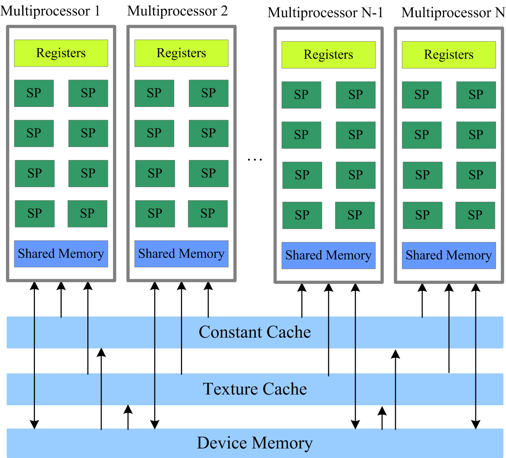

Introduction to GPU architecture
================================

.. questions::

   - Why use GPUs?
   - What is different about GPUs?
   - What is the programming model?

.. objectives::

   - Understand GPU architecture (resources available to programmer) 
   - Understand execution model 
   - Understand 

.. prereq::

   1. Basic C or FORTRAN
   2. Basic knowledge about processes and threads

Moore's law
-----------

The number of transistors in a dense integrated circuit doubles about every two years.
More transistors means smaller size of a single element, so higher core frequency can be achieved.
However, power consumption scales as frequency in third power, so the growth in the core frequency has slowed down significantly.
Higher performance of a single node has to rely on its more complicated structure and still can be achieved with SIMD, branch prediction, etc.

.. figure:: img/microprocessor-trend-data.png
   :align: center

   The evolution of microprocessors.
   The number of transistors per chip increase every 2 years or so.
   However it can no longer be explored by the core frequency due to power consumption limits.
   Before 2000, the increase in the single core clock frequency was the major source of the increase in the performance.
   Mid 2000 mark a transition towards multi-core processors.

Achieving performance has been based on two main strategies over the years:

    - Increase the single processor performance: 

    - More recently, increase the number of physical cores.

Why use GPUs?
~~~~~~~~~~~~~

The Graphics processing units (GPU) have been the most common accelerators during the last few years, the term GPU sometimes is used interchangeably with the term accelerator. 

.. figure:: img/comparison.png
   :align: center
   
   A growth in accelerator performance over the years in comparison to Intel CPU performance. 
   The Graphics Processing Unit (GPU) provides much higher instruction throughput and memory bandwidth than the CPU within a similar price and power envelope.

What is different?
~~~~~~~~~~~~~~~~~~

CPUs and GPUs were designed with different goals in mind. While the CPU is designed to excel at executing a sequence of operations, called a thread, as fast as possible and can execute a few tens of these threads in parallel, the GPU is designed to excel at executing many thousands of them in parallel. GPUs were initially developed for highly-parallel task of graphic processing and therefore designed such that more transistors are devoted to data processing rather than data caching and flow control. More transistors dedicated to data processing is beneficial for highly parallel computations; the GPU can hide memory access latencies with computation, instead of relying on large data caches and complex flow control to avoid long
memory access latencies, both of which are expensive in terms of transistors.

.. figure:: img/gpu_vs_cpu.png
   :align: center

    A comparison of the CPU and GPU architecture.
    CPU (left) has complex core structure and pack several cores on a single chip.
    GPU cores are very simple in comparison, they also share data and control between each other.
    This allows to pack more cores on a single chip, thus achieving very hich compute density.

.. list-table::  
   :widths: 100 100
   :header-rows: 1

   * - CPU
     - GPU
   * - General purpose
     - Highly specialized for parallelism
   * - Good for serial processing
     - Good for parallel processing
   * - Great for task parallelism
     - Great for data parallelism
   * - Low latency per thread
     - High-throughput
   * - Large area dedicated cache and control
     - Hundreds of floating-point execution units

GPU Programming Model
---------------------

Accelerator model
~~~~~~~~~~~~~~~~~~~~~~~~~~~~
.. figure:: img/HardwareReview.png
   :align: center

Accelerators are a separate main circuit board with the processor, memory, power management, etc., but they can not operate by themselves. They are always part of a system (host) in which the CPUs run the operating systems and control the programs execution. CPU acts as a main processor, controlling the execution workflow. This is reflected in the programming model. 

GPU Autopsy. Volta GPU
~~~~~~~~~~~~~~~~~~~~~~

.. figure:: img/volta-architecture.png
    :align: center

    A scheme of NVIDIA Volta GPU.

NVIDIA Volta streaming multiprocessor (SM):

- 64 single precision cores

- 32 double precision cores

- 64 integer cores

- 8 Tensore cores

- 128 KB memory block for L1 and shared memory

  - 0 - 96 KB can be set to user managed shared memory

  - The rest is L1

- 65536 registers - enables the GPU to run a very large number of threads

.. figure:: img/volta-sm-architecture.png
    :align: center

    A scheme of NVIDIA Volta streaming multiprocessor.
    
Heterogeneous Programming
~~~~~~~~~~~~~~~~~~~~~~~~~
.. figure:: img/heteprogra.jpeg
   :align: center

CPU (host) and GPU (device) codes are mixed. The host makes all calls, allocates the memory,  and  handles the memory transfers between CPU and GPU. The device code is executed by doing calls to functions written specifically to take advantage of the GPU (kernels). The kernel calls are asynchronous, the control is returned to the host after a kernel calls. All kernels are executed sequentially. 

Thread Hierarchy
~~~~~~~~~~~~~~~~
.. figure:: img/ThreadExecution.jpeg
   :align: center

Parallelism is exposed via ....

Automatic Scalability
~~~~~~~~~~~~~~~~~~~~~

Thread Scheduling. SIMT
~~~~~~~~~~~~~~~~~~~~~~~
.. figure:: img/Loom.jpeg
   :align: center

- Warps (waves) of 32 (64) parallel threads
- Consecutive, increasing thread IDs
- All executing one common instruction at a time
- Conditional branches are executed serially
- Memory accesses are per warp (wave)

CUDA C/HIP code example
~~~~~~~~~~~~~~~~~~~~~~~

.. typealong:: Vector addition on GPU

   .. tabs::

      .. tab:: Cuda C
         
         .. code-block:: C++
             
            ...

            int *a_d,*b_d,*c_d;
            cudaMalloc((void **)&a_d,Nbytes);
            cudaMalloc((void **)&b_d,Nbytes);
            cudaMalloc((void **)&c_d,Nbytes);

            cudaMemcpy(a_d,a,nBytes,cudaMemcpyHostToDevice);
            cudaMemcpy(b_d,b,nBytes,cudaMemcpyHostToDevice);

            vecAdd<<<gridSize,blockSize>>>(a_d,b_d,c_d,N);

            cudaDeviceSynchronize();
                                
      .. tab:: HIP
         
         .. code-block:: C++
            
            ...

            int *a_d,*b_d,*c_d;
            hipMalloc((void **)&a_d,Nbytes);
            hipMalloc((void **)&b_d,Nbytes);
            hipMalloc((void **)&c_d,Nbytes);

            hipMemcpy(a_d,a,Nbytes,hipMemcpyHostToDevice));
            hipMemcpy(b_d,b,Nbytes,hipMemcpyHostToDevice));

            hipLaunchKernelGGL(vecAdd, dim3(gridSize), dim3(blockSize), 0, 0, a_d,b_d,c_d,N);
          
            hipDeviceSynchronize();

.. code-block:: C++
   
   __global__ void vecAdd(int *a_d,int *b_d,int *c_d,int N)
   {
       int i = blockIdx.x * blockDim.x + threadIdx.x;
       if(i<N)
       {
         c_d[i] = a_d[i] + b_d[i];
       }
   }

Memory types
~~~~~~~~~~~~

Understanding the basic memory architecture is criticall in order to write efficient programs. GPUs have several types of memory with different access rules. All variables reside in the Global Memory.  This is accessible by all active threads. 
- *Registers*: The fastest form of memory. Accessible only by the thread
- *Shared Memory*: Almost as fast as a registers. Visible by any thread within blocks
- **Global Memory**: 150x slower then registers/shared memory. Accessible from any thread or from the host
- Memory with special access pattern. Heavily cached on chip.

Global Memory Access
~~~~~~~~~~~~~~~~~~~~
.. figure:: img/coalesced.png
   :align: center
- Memory transactions are done in continuous blocks of 32B, 64B, or 128B
- Address of the first element is aligned to 16x the size of the first element

Shared Memory Access
~~~~~~~~~~~~~~~~~~~~

- Shared memory is divided into banks (allowing only one access per cycle)
- Parallel access: multiple addresses accessed over multiple banks
- Serial access: multiple addresses in the same bank
- Broadcast access: a single address read in a single bank (by the whole warp)

Unified Memory Access
~~~~~~~~~~~~~~~~~~~~~~
   
- Data movement appears more transparent to the application
- Creates a pool of managed memory
- Each allocation is accessible on both the CPU and GPU with the same pointer
- System automatically migrates data between the host and device, as needed

Streams
-------

Overlapping Computations and Data Movements
~~~~~~~~~~~~~~~~~~~~~~~~~~~~~~~~~~~~~~~~~~~
.. figure:: img/Timeline.png
   :align: center

- A sequence of asynchronous GPU operations that execute on a device in the order issued by the host code.
- Operations within a stream are guaranteed to execute in the prescribed order
- Operations in different streams may run concurrently or interleaved

Second heading
--------------

.. exercise::

   TODO get the students to think about the content and answer a Zoom quiz

.. solution::

   Hide the answer and reasoning in here

Some source code
----------------

Sometimes we need to look at code, which can be in the webpage and optionally
you can pull out only some lines, or highlight others. Make sure both C++ and Fortran examples exist and work.

.. typealong:: The field data structure

   .. tabs::

      .. tab:: C++

         .. literalinclude:: code-samples/serial/heat.h
                        :language: cpp
                        :lines: 7-17
                                
      .. tab:: Fortran

         .. literalinclude:: code-samples/serial/fortran/heat_mod.F90
                        :language: fortran
                        :lines: 9-15

Building the code
-----------------

If there's terminal output to discuss, show something like::

  nvc++ -g -O3 -fopenmp -Wall -I../common -c main.cpp -o main.o
  nvc++ -g -O3 -fopenmp -Wall -I../common -c core.cpp -o core.o
  nvc++ -g -O3 -fopenmp -Wall -I../common -c setup.cpp -o setup.o
  nvc++ -g -O3 -fopenmp -Wall -I../common -c utilities.cpp -o utilities.o
  nvc++ -g -O3 -fopenmp -Wall -I../common -c io.cpp -o io.o
  nvc++ -g -O3 -fopenmp -Wall -I../common main.o core.o setup.o utilities.o io.o ../common/pngwriter.o -o heat_serial  -lpng

Running the code
----------------

To show a sample command line, use this approach

.. code-block:: bash

   ./heat_serial 800 800 1000

.. keypoints::

   - TODO summarize the learning outcome
   - TODO
