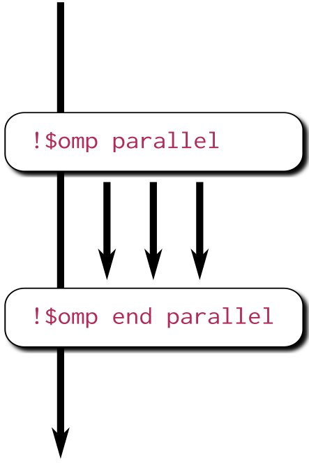

Why OpenMP offloading?
======================

.. questions::

   - When and why should I use OpenMP offloading in my code?

.. objectives::

   - Understand shared parallel model
   - Understand program execution model
   - Understand basic constructs 

.. prereq::

   1. Basic C or FORTRAN

Computing in parallel
~~~~~~~~~~~~~~~~~~~~~

The underlying idea of parallel computing is to split a computational problem into smaller subtasks. Many subpsubtasks can then be solved *simultaneously* by multiple processing units. 

   
   Computing in parallel.

How a problem is split into smaller subtasks depends fully on the problem. There are various paradigms and programming approaches how to do this. 

Distributed- vs. Shared-Memory Architecture
-------------------------------------------

Most of computing problems are not trivially parallelizable, which means that the subtasks need to have access from time to time to some of the results computed by other subtasks. The way subtasks exchange needed information depends on the available hardware.

.. figure:: img/distributed_vs_shared.png
   :align: center
   
   Distributed- vs shared-memory parallel computing.

In a distributed memory environment each computing unit operates independently from the others. It has its own memory and it  **cannot** access the memory in other nodes. The communication is done via network and each computing unit runs a separate copy of the operating system. In a shared memory machine all computing units have access to the memory and can read or modify the variables within.

Processes and threads
---------------------

The type of environment (distributed- or shared-memory) determines the programming model. There are two types of parallelism possible, process based and thread based. 

For distributed memory machines a process basedparallel programming model is employed. The processes are independent execution units which have their *own memory* address spaces. They are created when the parallel program is started and they are only terminated at the end. The communication between them is done explicitly via message passing like the MPI.

On the shared memory architectures it is possible to use a thread based parallelism.  The threads are light execution units and can be created and destryed at a relatively small cost. The threads have their own state information but they *share* the *same memory* adress space. When needed the communication is done though the shared memory. 

Both approaches have their advantages and disadvantages.  Distributed machines are relatively cheap to build and they  have an "infinite " capacity. In principle one could add more and more computing units. In practice the more computing units are used the more time consuming is the communication. The shared memory systems can achive food permformance and the programing model is quit simple. However they are limited by the memory capacity and by the access speed. In addition in the shared parallel model it is much easier to create races conditions.

OpenMP
~~~~~~

OpenMP is de facto standard for threaded based parallelism. It is relatively easy to implement. The whole the technology suite contains the library routines, the compiler directives and environment variables. The parallelization is done providing "hints" (directives) about the regions of code which are targeted for parallelization. The compiler then chooses how to implement these hints as best as possible. The compiler directives are comments in Fortran and pragmas in C/C++. No OpenMP support in hte system they become comments and the code works just any other  serial code.

Fork-join model
---------------

OpenMP programs begin as a single process, the **master** thread, until they reach a parallel region, which then spawns a team of threads. 

.. figure:: img/threads.png
   :align: center

Parallel regions and data sharing
~~~~~~~~~~~~~~~~~~~~~~~~~~~~~~~~~ 

The core elements of OpenMP are the constructs for thread creation, workload distribution (work sharing), data-environment management, thread synchronization, user-level runtime routines and environment variables.

Parallel construct
------------------

The parallel construct is used to fork additional threads to carry out the work enclose in it. 

    
   Outside of a parallel region there is only one threas, while inside there are N threads 
   
All threads inside the construct execute the same, there is not work sharing yet.

   .. tabs::

      .. tab:: C
         
         .. code-block:: C++
             
            #include <stdio.h>
            #include <omp.h>
              int main(int argc, char argv[]){
              int omp_rank;
            #pragma omp parallel private(omp_rank)
             {
               omp_rank = omp_get_thread_num();
               printf("Hello world! by
               thread %d", omp_rank);
              }
             }
                                
      .. tab:: HIP
         
         .. code-block:: Fortran
            
              program hello
              use omp_lib
              integer :: omp_rank
            !$omp parallel private(omp_rank)
              omp_rank = omp_get_thread_num()
              print *, 'Hello world! by &
              thread ', omp_rank
            !$omp end parallel
              end program hello
              
Data sharing
~~~~~~~~~~~~ 

Work sharing
~~~~~~~~~~~~ 

The work can be splitted between 

Second heading
--------------

Some more text, with a figure

.. figure:: img/stencil.svg
   :align: center

   This is a sample image

.. exercise::

   TODO get the students to think about the content and answer a Zoom quiz

.. solution::

   Hide the answer and reasoning in here

Some source code
----------------

Sometimes we need to look at code, which can be in the webpage and optionally
you can pull out only some lines, or highlight others. Make sure both C++ and Fortran examples exist and work.

.. typealong:: The field data structure

   .. tabs::

      .. tab:: C++

         .. literalinclude:: code-samples/serial/heat.h
                        :language: cpp
                        :lines: 7-17
                                
      .. tab:: Fortran

         .. literalinclude:: code-samples/serial/fortran/heat_mod.F90
                        :language: fortran
                        :lines: 9-15

Building the code
-----------------

If there's terminal output to discuss, show something like::

  nvc++ -g -O3 -fopenmp -Wall -I../common -c main.cpp -o main.o
  nvc++ -g -O3 -fopenmp -Wall -I../common -c core.cpp -o core.o
  nvc++ -g -O3 -fopenmp -Wall -I../common -c setup.cpp -o setup.o
  nvc++ -g -O3 -fopenmp -Wall -I../common -c utilities.cpp -o utilities.o
  nvc++ -g -O3 -fopenmp -Wall -I../common -c io.cpp -o io.o
  nvc++ -g -O3 -fopenmp -Wall -I../common main.o core.o setup.o utilities.o io.o ../common/pngwriter.o -o heat_serial  -lpng

Running the code
----------------

To show a sample command line, use this approach

.. code-block:: bash

   ./heat_serial 800 800 1000

.. keypoints::

   - TODO summarize the learning outcome
   - TODO
