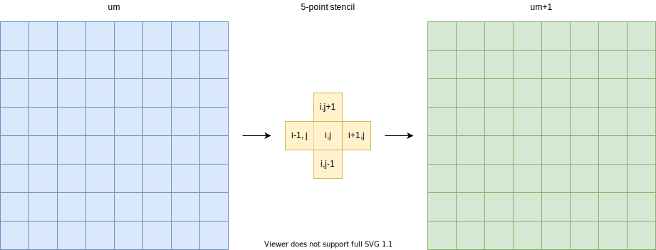
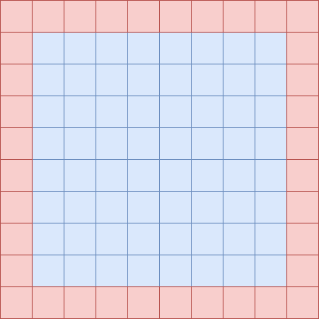

Heat diffusion mini-app
=======================

.. questions::

   - How can I learn about OpenMP on GPUs with a practical example?
   - What should I think about when porting code to use GPUs?

.. objectives::

   - Understand the structure of a mini-app that models heat diffusion
   - Understand how the 5-point stencil operates
   - Understand that the loops influence the duration of the mini-app
   - Understand the expected output of the mini-app

.. prereq::

   1. Understanding of how to read either C++ or Fortran code
   2. Running programs from a terminal command line

Heat diffusion
--------------

Heat flows in objects according to local temperature differences, as if seeking local equilibrium.
Such processes can be modelled with partial differential equations via discretization to a regular grid.
Solving for the flow over time can involve a lot of computational effort.
Fortunately that effort is quite regular and so can suit parallelization with a variety of techniques.
That includes OpenMP offload to GPUs, so first we will introduce this mini-app and then use it to explore OpenMP offload

The partial differential equation
---------------------------------

The rate of change of the temperature field :math:`u(x, y, t)` over two spatial
dimensions :math:`x` and :math:`y` and time :math:`t`
with diffusivity :math:`\alpha` can be modelled via the equation

.. math::
   \frac{\partial u}{\partial t} = \alpha \nabla^2 u

where :math:`\nabla` is the Laplacian operator, which describes how
the temperature field varies with the spatial dimensions :math:`x` and
:math:`y`. When those are continuous variables, that looks like

.. math::
   \frac{\partial u}{\partial t} = \alpha \left( \frac{\partial^2 u}{\partial x^2} + \frac{\partial^2 u}{\partial x^2}\right)

Because computers are finite devices, we often need to solve such equations numerically, rather than analytically.
This often involves *discretization*, where spatial and temporal variables only take on specific values from a set.
In this mini-app we will discretize all three dimensions :math:`x`, :math:`y`, and :math:`t`, such that

.. math::
   \nabla^2 u  &= \frac{u(i-1,j)-2u(i,j)+u(i+1,j)}{(\Delta x)^2} \\
       &+ \frac{u(i,j-1)-2u(i,j)+u(i,j+1)}{(\Delta y)^2}

where :math:`u(i,j)` refers to the temperature at location with
integer index :math:`i` within the domain of :math:`x` spaced by
:math:`\Delta x` and location with integer index :math:`j` within the
domain of :math:`y` spaced by :math:`\Delta y`.

Given an initial condition :math:`(u^{t=0})`, one can follow the time
dependence of the temperature field from state :math:`m` to
:math:`m+1` over regular time steps :math:`\Delta t` with explicit
time evolution method:

.. math::
    u^{m+1}(i,j) = u^m(i,j) + \Delta t \alpha \nabla^2 u^m(i,j) 

This equation expresses that the time evolution of the temperature
field at a particular location depends on the value of the field at
the previous step at the same location *and* four adjacent locations:

   This example model uses an 8x8 grid of data in light blue in state
   :math:`m`, each location of which has to be updated based on the
   indicated 5-point stencil in yellow to move to the next time point
   :math:`m+1`.

.. exercise::

   How much arithmetic must be done to evolve each location at each time step?

.. solution::

   10 arithmetic operations per location per time step. 3 in each of 2
   numerators, 1 to divide by each pre-computed denominator, and two
   additions to update :math:`u`.

.. exercise::

   How much arithmetic must be done to evolve all locations in the grid for 20 steps?

.. solution::

   There's 64 locations and 20 steps and each does the same 10
   operations, so :math:`10*8*8*20 = 12800` arithmetic operations
   total.

Spatial boundary conditions
---------------------------

Something must happen at the edges of the grid so that the stencil does a valid operation.
One alternative is to ignore the contribution of points that are outside the grid.
However, this tends to complicate the implementation of the stencil and is also often non-physical.
In a real problem, there is always somethign outside the grid!
Sometimes it makes sense to have periodic boundaries to the grid, but that is complex to implement.
In this mini-app, we will have a ring of data points around the grid.
Those will have a fixed value that is not updated by the stencil,
although they do contribute to the stencil operation for their neighbors.

   This example model uses an 8x8 grid of data in light blue with an
   outer ring in red of boundary grid sites whose temperature values
   are fixed. This lets the stencil operate on the blue region in a
   straightforward way.

The source code
---------------

Now we'll take a look at the source code that will do this for us!
Let's look at the data structure describing the field:

.. typealong:: The field data structure

   .. tabs::

      .. tab:: C++

         .. literalinclude:: code-samples/serial/heat.h
                        :language: cpp
                        :lines: 7-17
                                
      .. tab:: Fortran

         .. literalinclude:: code-samples/serial/fortran/heat_mod.F90
                        :language: fortran
                        :lines: 9-15

Next, the routine that applies the stencil to the previous field to compute the current one:

.. typealong:: The core evolution operation

   .. tabs::

      .. tab:: C++

         .. literalinclude:: code-samples/serial/core.cpp
                        :language: cpp
                        :lines: 5-36
                                
      .. tab:: Fortran

         .. literalinclude:: code-samples/serial/fortran/core.F90
                        :language: fortran
                        :lines: 7-38

Then the routine that handles the main loop over time steps:
                                
.. typealong:: The main driver function

   .. tabs::

      .. tab:: C++

         .. literalinclude:: code-samples/serial/main.cpp
                        :language: cpp
                        :lines: 8-9,13-18,25-33,37-39,43-47,64
                                
      .. tab:: Fortran

         .. literalinclude:: code-samples/serial/fortran/main.F90
                        :language: fortran
                        :lines: 1-17,19-20,25-26,33-38,42-43,47-48,63

There's other supporting code to handle user input and produce nice images
of the current field, but we won't need to touch those, so we won't spend time
looking at them now.
In the real version of the code we have seen, there's also calls to libraries to record the time taken.
We'll need that later so we understand how fast our code is.

We should look at the routines that initialize the field data structures:

.. typealong:: The setup routines

   .. tabs::

      .. tab:: C++

         .. literalinclude:: code-samples/serial/utilities.cpp
                        :language: cpp
                        :lines: 25-31
                                
      .. tab:: Fortran

         .. literalinclude:: code-samples/serial/fortran/setup.F90
                        :language: fortran
                        :lines: 77-78

Building the code
-----------------

The code is set up so that you can change to its directory,
type `make` and it will build and run for you.

.. typealong:: Building the code 

   .. tabs::

      .. tab:: C++

         .. code-block:: bash
            
            cd serial
            make
                                
      .. tab:: Fortran

         .. code-block:: bash
            
            cd serial/fortran
            make

You will see output something like::

  nvc++ -g -O3 -fopenmp -Wall -I../common -c main.cpp -o main.o
  nvc++ -g -O3 -fopenmp -Wall -I../common -c core.cpp -o core.o
  nvc++ -g -O3 -fopenmp -Wall -I../common -c setup.cpp -o setup.o
  nvc++ -g -O3 -fopenmp -Wall -I../common -c utilities.cpp -o utilities.o
  nvc++ -g -O3 -fopenmp -Wall -I../common -c io.cpp -o io.o
  nvc++ -g -O3 -fopenmp -Wall -I../common main.o core.o setup.o utilities.o io.o ../common/pngwriter.o -o heat_serial  -lpng

which produces an executal program called ``heat_serial``.

Running the code
----------------

The code lets you choose the spatial dimensions and the number of time steps on the command line.
For example, to run an 800 by 800 grid for 1000 steps, run

.. code-block:: bash

   ./heat_serial 800 800 1000

Try it now!

.. exercise::

   How long does the iteration take if you double the number of steps?
   How long does the iteration take if you double the number of grid points in each direction?

.. solution::

   Doubling the number of steps doubles the total amount of work, so should take around twice as long.
   Doubling both numbers of grid points is four times as much work, so should take around four times as long.

You can see the output on the terminal, like::

  Average temperature at start: 59.762281
  Iterations took 0.426 seconds.
  Average temperature: 58.065097

This report will help us check whether our attempts to optimize made the code faster while keepint it correct.

Initial and boundary conditions
-------------------------------

When solving PDEs, the initial conditions determine the possible solutions.
The mini-app automatically sets up a disk of cold grid points in the center at temperature 5, with warm grid points around it at temperature 65.

   Initial conditions of the grid.
   The boundary layers are not shown.

There is a fixed boundary layer of one grid point on all sides, two of which are warm (temperature 70 and 85) and two cold (temperature 20 and 5).
Early on, the disk and its surroundings dominate the contents of the grid, but over time, the boundary layers have greater and greater influence.

.. exercise::

   To which average temperature will the grid converge?

.. solution::

   Eventually, the boundary conditions will dominate.
   Each contributes equally if the sides are of equal length.
   The average of the grid will be the average of the boundaries, ie. :math:`(70+20+85+5)/4` which is :math:`45`.

Visualizing the output
----------------------

The mini-app has support for writing an image file that shows the state of the grid every 1500 steps.
Below we can see the progression over larger numbers of steps:

..
   This image was made with the montage tool from ImageMagick.
   Run ./heat_serial 800 800 42000 then
   montage heat_?000.png heat_??000.png heat_montage.png

.. figure:: img/heat_montage.png
   :align: center

   Over time, the grid progresses from the initial state toward
   an end state where one triangle is cold and one is warm.
   The average temperature tends to 45.

We can use this visualization to check that our attempts at parallelization are working correctly.
Perhaps some bugs can be resolved by seeing what distortions they introduce.

.. keypoints::

   - The heat equation is discretized in space and time
   - The implementation has loops over time and spatial dimensions
   - The implementation reports on the contents of the grid so we can understand correctness and performance easily.
